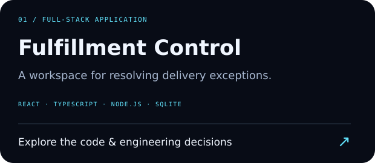

# Fulfillment Control

A full-stack operations dashboard for investigating fulfillment exceptions. Original portfolio demonstration with synthetic orders and facilities; no employer systems or data.



## Run locally

Requires Node 24 (built-in SQLite and TypeScript stripping).

```sh
npm ci
npm run build
npm start
# Open http://127.0.0.1:3000
```

For development, run `npm run api` and `npm run dev` in separate terminals. Vite proxies `/api` to port 3000. `npm test` runs store and real HTTP integration tests; `npm run check` also checks types and builds the UI.

## What it demonstrates

- React + TypeScript dashboard with search, severity/status filters, SLA metrics and case drawers.
- Create, assign, investigate, resolve and reopen workflows with mandatory resolution notes.
- SQLite transactions couple state changes to audit events.
- Optimistic concurrency rejects stale saves with HTTP 409 instead of overwriting another edit.
- Zod request validation, parameterized queries, capped JSON bodies and explicit error responses.

## Design

`src/` renders the UI; `server/app.ts` validates HTTP requests; `server/store.ts` owns workflow invariants and persistence. A case version increments on every successful mutation. The check, update and audit insert run in one `BEGIN IMMEDIATE` transaction. The database defaults to `data/fulfillment.db`; set `DB_PATH` to override. Demo rows are seeded only into an empty store; set `SEED_DEMO=false` to disable them.

| Endpoint | Purpose |
| --- | --- |
| `GET /api/cases?q=&status=&severity=` | Search and filter |
| `POST /api/cases` | Open a case |
| `PATCH /api/cases/:id` | Update with the current `version` |
| `GET /api/cases/:id/events` | Read audit history |
| `GET /api/health` | Process health |

## Scope and tradeoffs

Designed for a local demo, not production deployment. There is no authentication, authorization or multi-tenant boundary; keep the default loopback binding. SQLite serializes writers, and the UI loads the full case list. A production evolution would add identity, server pagination, migrations, structured telemetry and integration with actual order events. Audit events record workflow history, not authenticated actor attribution.
